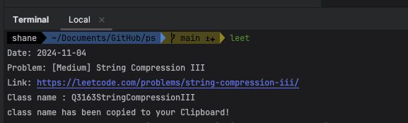

# 💻 Problem Solving

## Intro

This repository is history of my algorithm practice. PS is my favourite hobby so I always wanna do better, be exceptional.

I'm a kind of beginner yet but I really enjoy it and love to share idea with others who are also interested in.

most of them are written in Java. more of Kotlin ones will be added in the future.

**Any feedback will be always appreciated.**

I use those websites to solve problems, mostly leetcode which I never forgot the daily ones.

- [Leetcode](https://leetcode.com/)

> https://leetcode.com/Shane-Park/

- [Programmers](https://programmers.co.kr/)
- [Baekjoon Online Judge](www.acmicpc.net)

## Leetcode ClassName Factory

> located in [src.main.java.shane.leetcode.util.ClassNameFactory](https://github.com/Shane-Park/problem-solving/blob/main/src/main/java/shane/leetcode/util/ClassNameFactory.java)

If you're a Leetcode lover who wants to code on their own IDE not the web, you can use this Class to get a proper class name easily.

- open your bash configuration

```bash
vi ~/.zshrc
```

- and add alias. 

```bash
alias leet="java ~/Documents/git/shane/ps/src/main/java/shane/leetcode/util/ClassNameFactory.java"
```

> Reminder : if you are using Java 11 or higher, you can run single file program without without compiling, otherwise you should compile it before run.
>
> also don't forget to modify directories on your taste.

```zsh
source ~/.zshrc
```

That's it. now you copy the problem title and execute it. it'll automatically make and put proper class name into your clipboard.



## ShaneUtils

> https://github.com/Shane-Park/shaneutils

I made small utility package to help PS. it converts String to array, list, etc.. and also has lots of tools for testing the code especially for leetcode. check it out!

<br><Br>

```
I tried my best to avoid any license issue but if you have any inqury please send me an e-mail.
Any issue will be handled in 12 hours I guarantee. Thank you.

psh40963@naver.com
```
